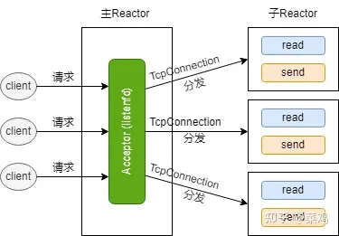

## chatserver

### 环境
- 基于vscode远程连接centos7实现；
### 功能
- 部署nginx、tcp负载均衡环境中的集群通信服务器和客户端源码, 基于muduo开源库实现，数据库包括有redis,mysql；
### 内容
- 1、使用 muduo 库作为网络核心模块、提高高并发网络 I/O 服务，解耦网络和业务模块代码。
- 2、调用json基于 json 序列化和反序列化通信消息。
- 3、配置 nginx 基于轮询的负载均衡,实现服务器的集群功能，提高并发能力。
- 4、基于 redis 的发布-订阅功能,实现跨服务器的消息通信。
- 5、使用 mysql 数据库实现项目数据的持久化。
- 6、使用连接池提高数据库的数据存取能力。

### muduo库简介
- 高性能：muduo库采用了epoll+多线程的设计，可以充分发挥多核处理器的性能，提高服务器的并发处理能力。
- 异步编程模型：muduo库使用了事件驱动的异步编程模型，可以有效地处理大量的并发连接，提高服务器的吞吐量。

muduo由陈硕大佬开发，是一个基于非阻塞IO和事件驱动的C++高并发TCP网络库，使用的线程模型是one loop per thread，所谓one loop per thread指的是：
- 一个线程只能有一个事件循环（EventLoop）
- 一个文件描述符（file descriptor，通常简称fd）只能由一个线程进行读写，换句话说就是一个- TCP连接必须归属于某个EventLoop管理。但返过来不一样，一个线程却可以管理多个fd。
为什么要选择one loop per thread模型：（P62，3.3.1节）

#### 如果一个TCP链接在多个线程中处理，会出现如下情况：
- socket被意外关闭。A线程要从socket中读/写消息，但是该socket被B线程给close了，更糟的情况是，B close后，新的连接的socket刚好使用的是B关闭的socket，那A线程再次进行读/写早已经不是原来的那个连接了（这种现象叫串话）
- 不考虑关闭，只考虑读写也有问题。比如A、B线程同时对一个TCP连接进行读操作，如果两个线程几乎同时各自收到一部分消息，那如何把数据拼接成完整的消息，如何知道哪部分数据先到达。如果同时写一个socket，每个线程只发送半条消息，接收方又该怎么处理，如果加锁，那还不如直接就让一个线程处理算了。

#### one loop per thread优点
- 线程数目基本固定，不用频繁创建或者销毁线程；
- 可以很方便的在各个线程之间进行负载调配；
- IO事件发生的线程基本是固定不变的，不必考虑TCP连接事件的并发（即fd读写都是在同一个线程进行的，不是A线程处理写事件B线程处理读事件）；
#### muduo采用的多Reactor结构。在muduo中，每一个线程都可以看作是一个Reactor，主线程（主Reactor）只负责监听接收新连接，并将接收的连接对应的fd分发到子Reactor中，子线程（子Reactor）就负责处理主线程分发给自己的fd上的事件，比如fd上发生的可读、可写、错误等事件，另外从fd上读取数据后，要进行的业务逻辑也是由子线程负责的。基本框架如下图所示：

